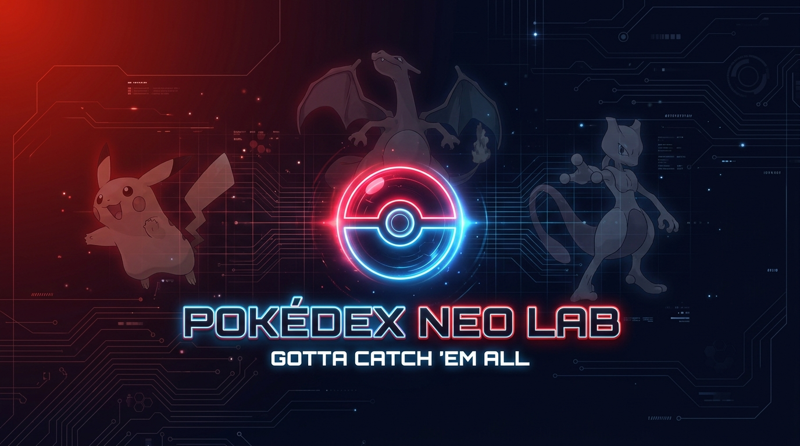

<div align="center">



<br>

> 🔴 _Explora, filtra, compara y colecciona Pokémon en una experiencia web interactiva con animaciones fluidas, datos en tiempo real de PokeAPI y un diseño inspirado en la Pokédex original del anime._

<br>


</div>

---

## 🗺️ Tabla de Contenidos

- [✨ Demo](#-demo)
- [🎮 Features](#-features)
- [🏗️ Arquitectura](#️-arquitectura)
- [🚀 Instalación](#-instalación)
- [🔌 API Endpoints](#-api-endpoints)
- [⌨️ Atajos de Teclado](#️-atajos-de-teclado)
- [🎨 Paleta de Colores](#-paleta-de-colores)
- [📄 Licencia](#-licencia)

---

## ✨ Demo

> _"Un Pokédex de alta tecnología para todo Entrenador"_ — Profesor Oak

**Frontend** → Abre `frontend/index.html` en tu navegador.
**Backend** → Ejecuta el servidor Express para proxy y caché de PokeAPI.

```bash
# Levantar el backend
cd backend
npm install
npm run dev
# 🚀 http://localhost:3000
```

---

## 🎮 Features

<table>
<tr>
<td width="50%">

### 🔍 Exploración Total
- **1025 Pokémon** — Generaciones I a IX completas
- **Filtros combinables** — por nombre, `#025`, tipo (18), generación, orden por ID / nombre / CP
- **Infinite scroll** — `IntersectionObserver` + fallback botón `Cargar más +24`

### ♥️ Favoritos & Colección
- Guarda tus Pokémon favoritos con ♥ en cada tarjeta
- Sección dedicada con tabs y contador vivo
- Vaciar y exportar a `.txt`
- Persiste en `localStorage`

### ⚖️ Comparador 2vs2
- Selecciona 2 Pokémon con ⚖️
- Modal lado a lado con barras animadas
- Ganador automático por CP total

</td>
<td width="50%">

### ✨ Vista Detallada
- Arte oficial HD + switch **Normal / ✨ Shiny** con glow
- Descripción en ES/EN, peso, talla, CP total
- Stats animadas con barras de progreso
- Habilidades detalladas
- 🔊 Grito del Pokémon en `.ogg`

### 🌙 Tema Claro / Oscuro
- Toggle con persistencia en `localStorage`
- Respeta `prefers-color-scheme` del sistema

### 🎬 Animaciones Premium
- **GSAP** — Flip, ScrollTrigger, stagger
- Luces LED animadas estilo Pokédex del anime

</td>
</tr>
</table>

---

## 🏗️ Arquitectura

```
pokédex-neo-lab/
│
├── 🎨 frontend/                    # Cliente Web
│   ├── index.html                  # Landing page principal
│   ├── css/
│   │   └── pokedex.css             # Estilos + tema claro/oscuro
│   └── js/
│       ├── api.js                  # Comunicación con backend
│       └── pokedex.js              # Lógica principal de la app
│
├── ⚙️ backend/                     # Servidor Express
│   ├── package.json                # Dependencias (cors, dotenv, express)
│   └── src/
│       ├── index.js                # Entry point + middlewares
│       ├── routes/
│       │   └── pokemon.routes.js   # Rutas de la API
│       ├── controllers/
│       │   └── pokemon.controller.js  # Lógica de endpoints
│       └── services/
│           └── pokeapi.service.js  # Proxy + caché a PokeAPI
│
└── 📄 README.md
```

---

## 🚀 Instalación

### Prerrequisitos

| Herramienta | Versión |
|---|---|
| Node.js | ≥ 18.x |
| npm | ≥ 9.x |
| Navegador moderno | Chrome, Firefox, Edge |

### Pasos

```bash
# 1 · Clonar el repositorio
git clone https://github.com/alejoxpp/Pokedex.git
cd Pokedex

# 2 · Instalar dependencias del backend
cd backend
npm install

# 3 · Iniciar el servidor de desarrollo
npm run dev
# ✅ Pokédex Backend corriendo en http://localhost:3000

# 4 · Abrir el frontend
# Abre frontend/index.html en tu navegador favorito
```

---

## 🔌 API Endpoints

> Servidor Express como proxy inteligente hacia [PokeAPI v2](https://pokeapi.co/docs/v2)

| Método | Ruta | Descripción |
|---|---|---|
| `GET` | `/api/pokemon` | Lista de Pokémon con filtros `?gen=1&limit=24&type=fire&search=char` |
| `GET` | `/api/pokemon/:idOrName` | Detalle completo de un Pokémon |
| `GET` | `/api/trivia` | Pregunta aleatoria de trivia Pokémon |
| `GET` | `/api/team` | Obtener equipo guardado |
| `POST` | `/api/team` | Guardar equipo de 6 Pokémon |

### Fuentes de Datos Externas

```
📡 https://pokeapi.co/api/v2/pokemon/{id}          → Datos base
📡 https://pokeapi.co/api/v2/pokemon-species/{id}   → Especie, hábitat, color
🔊 https://raw.githubusercontent.com/.../cries/{id}.ogg → Gritos oficiales
```

> ⚡ Cache 24h por generación · Concurrencia máxima: 20 peticiones

---

## ⌨️ Atajos de Teclado

```
 ┌─────────────────────────────────────────┐
 │  /      →  Enfocar barra de búsqueda    │
 │  Enter  →  Filtrar de inmediato         │
 │  ESC    →  Cerrar modal / limpiar       │
 │  ♥      →  Guardar en favoritos         │
 │  ⚖️      →  Añadir al comparador        │
 └─────────────────────────────────────────┘
```

---

## 🎨 Paleta de Colores

> _Inspirada en los colores oficiales de la franquicia Pokémon_

| Token | Color | Hex | Uso |
|---|---|---|---|
| `--poke-red` | 🔴 | `#E3350D` | Topbar, acentos, badges, botones primarios |
| `--poke-blue` | 🔵 | `#3564AE` | Botones secundarios, links, lente LED |
| `--poke-yellow` | 🟡 | `#FFCB05` | Bordes, highlights, hover states |

---

## 🛠️ Stack Tecnológico

<div align="center">

| Capa | Tecnología | Propósito |
|---|---|---|
| **Estructura** | HTML5 | Semántica + Accesibilidad |
| **Estilos** | CSS3 Vanilla | Tema dual + Variables + Animaciones |
| **Lógica** | JavaScript ES6+ | SPA sin framework |
| **Backend** | Express.js | Proxy API + Caché |
| **Animación** | GSAP 3.12 | Transiciones premium |
| **Tipografía** | Space Grotesk + Inter | Fuentes Google modernas |
| **Datos** | PokeAPI v2 | 1025+ Pokémon en tiempo real |

</div>

---

## 👨‍💻 Autor

**José Alejandro Perez Pabón** — [@alejoxpp](https://github.com/alejoxpp)

---

## 📄 Licencia

MIT — Datos proporcionados por [PokeAPI](https://pokeapi.co/docs/v2).

---

<div align="center">


</div>
